# Classic Models In Power BI

## Background
**Purpose:** In this page, we are going to create several dashboards for `Classic Models` that will help set KPIs to track performance within our teams.

## Technology
We will be taking advantage of Power BI Desktop, which provides a variety of visuals to represent your data.

## Dataset
The same data used in previous pages, Classic Models dataset loaded into MySQL, will be used.

## Preliminary
Before starting the scenarios, it is worth looking at the model diagram:

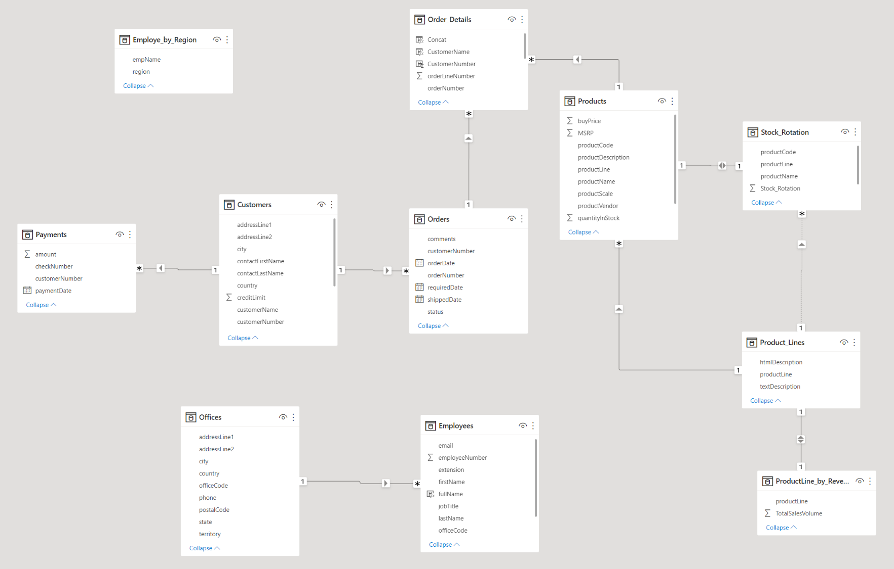
Fig.1.

Followed by all queries I have imported from MySQL:

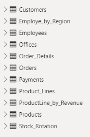
\
Fig.2.

Now we can kick off the case scenarios.

## Scenarios

### Scenario 1:
The purchasing department, responsible for maintaining the correct level of inventory, is asking for a breakdown of the following items:
- Funnel of quantity in stock by product line.
- Vertical column chart by product name showing current stock quantity.
- Stock rotation card, calculated from quantity sold.

The finance team is also interested in having visibility over inventory revenue, and they are asking if it is possible to achieve the following requirements:
- Horizontal column chart reflecting inventory value by product name.
- Inventory value card, calculated by multiplying stock quantity by buy price.
- Market value card, calculated by multiplying stock quantity by MSRP.

Both teams have agreed on having slicers by product line, code, and name. Please see the screenshot of the visual Classic Models Inventory:

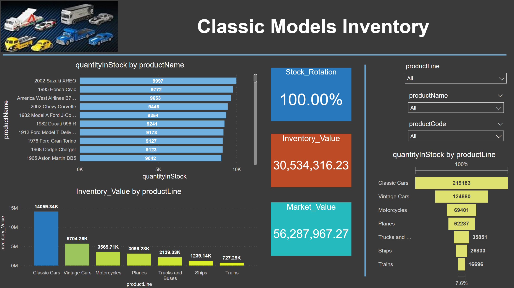
Fig.3.

Now we interact with the dashboard. For that, we set the slicer to product line `Planes` and see how nicely the features play out:

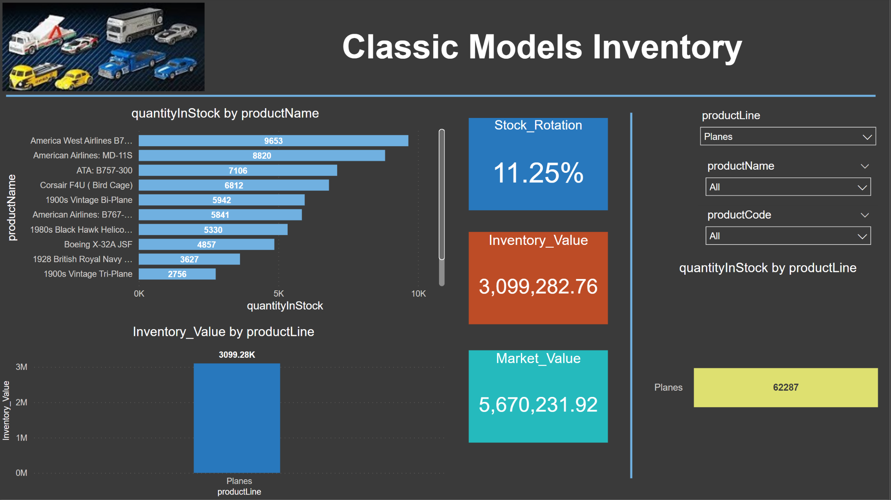
Fig.4.

Another example to wrap up scenario 1 would be to select the product name `1969 Ford Falcon`:

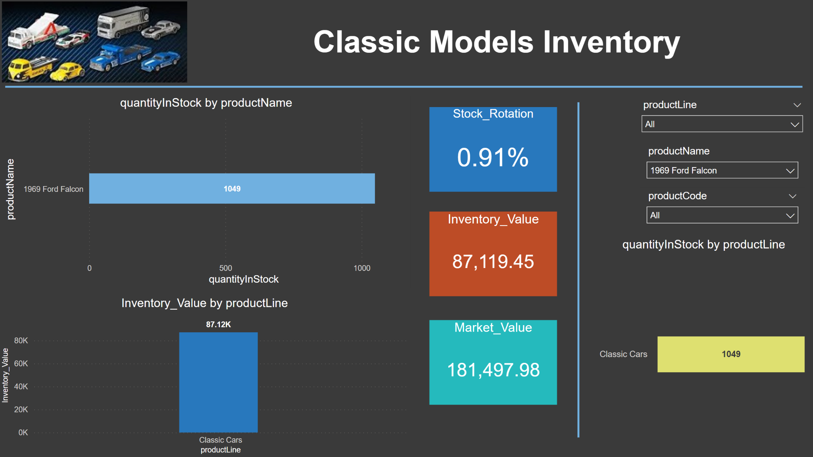
Fig.5.

### Scenario 2:
The finance team reached out to create a dashboard that fulfills the following requirements:
- One slicer for product line, product name, and customer name.
- A table sorted by order number containing customer name, product details, and amount by order line.
- A pie chart showing total revenue by product line.
- Horizontal column chart showing revenue by product.
- Total revenue value card, total revenue since the company started.

Note that in the table there is a column `Concat,` the result of concatenating order number plus order line, which helps to sort by order number. Please see the result of this visual:

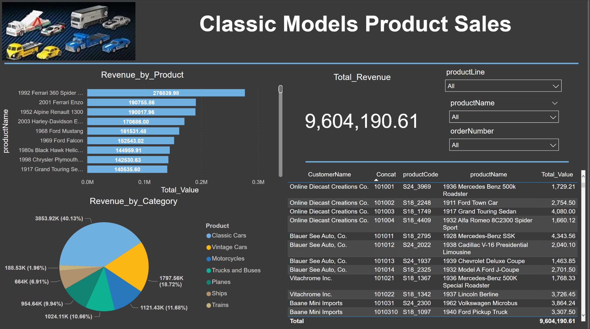
Fig.6.

The sales team set the slicer to order number `10129,` and they are quite happy with the level of detail this dashboard provides:

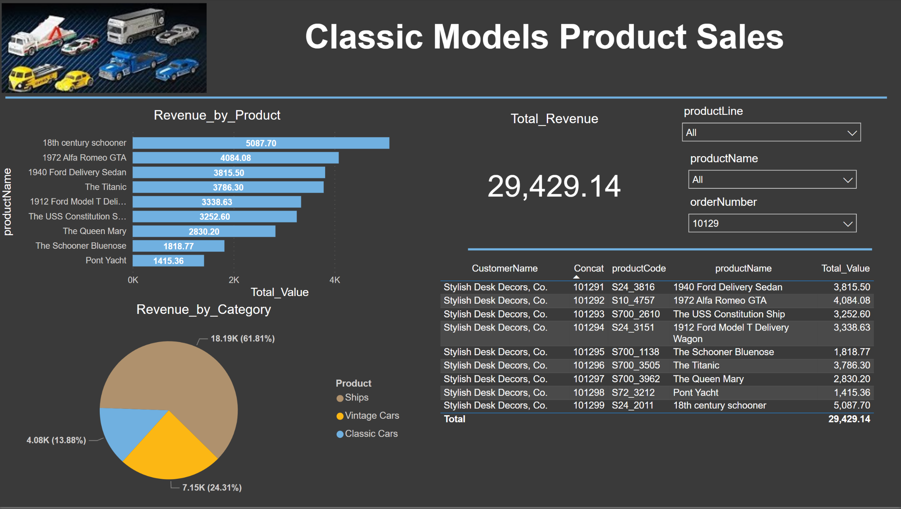
Fig.7.

Product line `Classic Cars` has the highest revenue. We want to break it down to see which product and order line have the highest value:

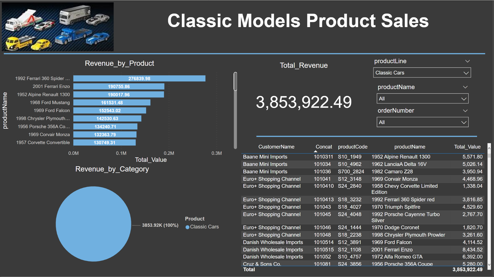
Fig.8.

### Scenario 3:
Our sales colleagues suggested a dashboard with the following requirements:
- One slicer for product line and another for customer name.
- A pie chart showing yearly number of orders.
- A table containing products, quantity ordered, and sorted by total revenue.
- A table listing customers, country, sales rep, and sorted by revenue.
- A map locating each customer city by revenue.

After considering the above requirements, we created the following visual:

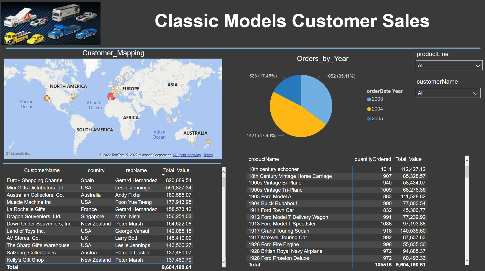
Fig.9.

To see this visual functioning, set the slicer to customer name `Euro+ Shopping Channel.` The map zooms in, and the breakdown of orders by year, along with a ranking of products and quantity ordered by revenue, adds more insights:

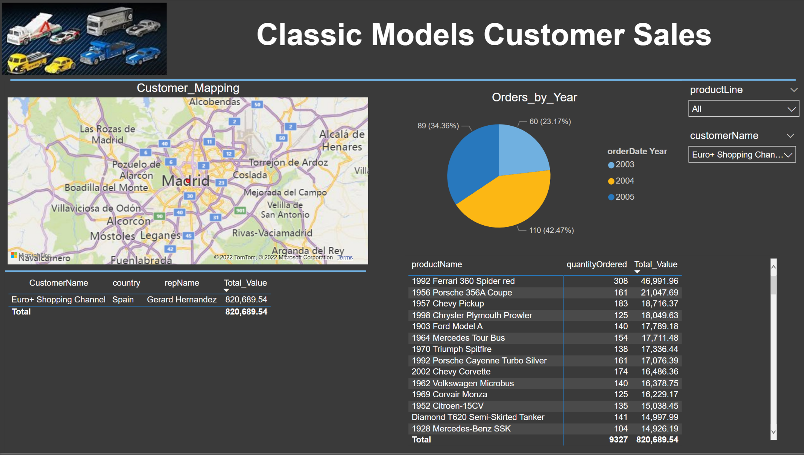
Fig.10.
\

Product line `Trains` has the lowest revenue. Now we want to focus on it, maybe this visual helps our sales team increase sales on `Trains`:

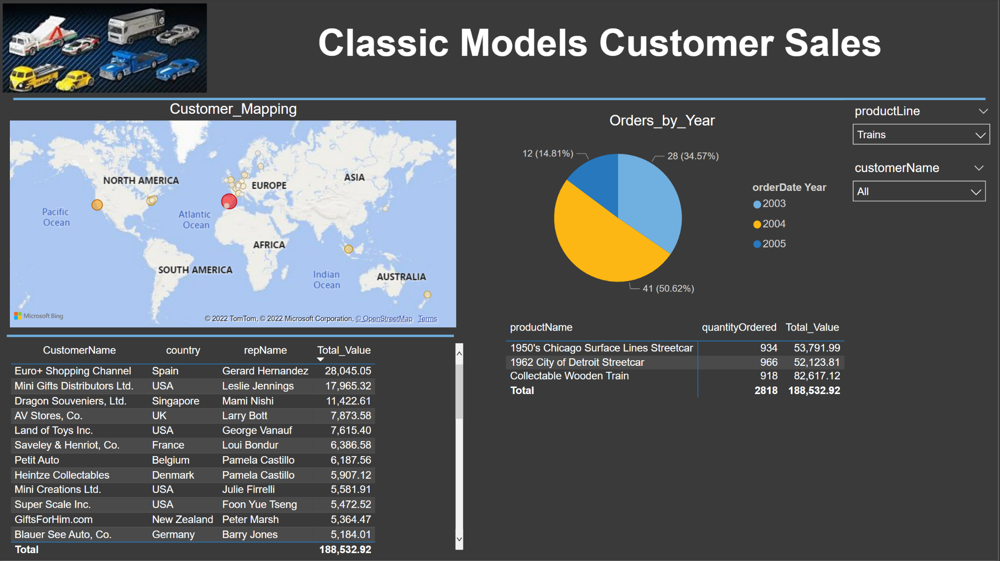
Fig.11.

### Scenario 4:
For the last scenario, the sales team wants to have a dashboard with the following points:
- One slicer for each of the following items: region, rep name, and product line.
- A matrix ordered by revenue showing regions and markets assigned to each sales rep.
- A table for customers and their countries sorted by revenue.
- A funnel listing regions by revenue.
- Horizontal column chart ranking sales reps by revenue generated.

After a bit of work, the resulting dashboard looks like this:

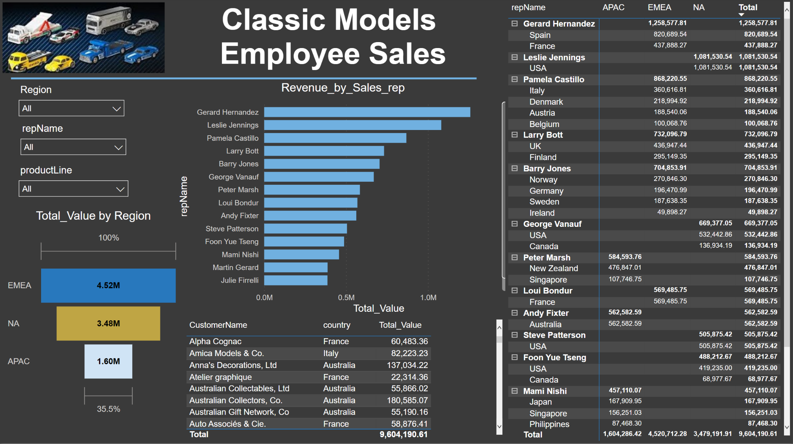
Fig.12.

Diane Murphy, the CEO, wants to see how EMEA has performed since the company was established. Selecting the slicer region `EMEA` gives us the following result:

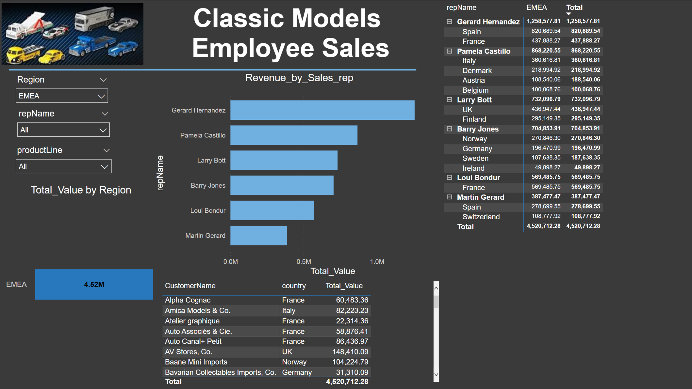
Fig.13.

Gerard Hernandez appears to be the top sales performer. To dive deeper into his metrics, select his name in the slicer rep name, and the results are shown below:

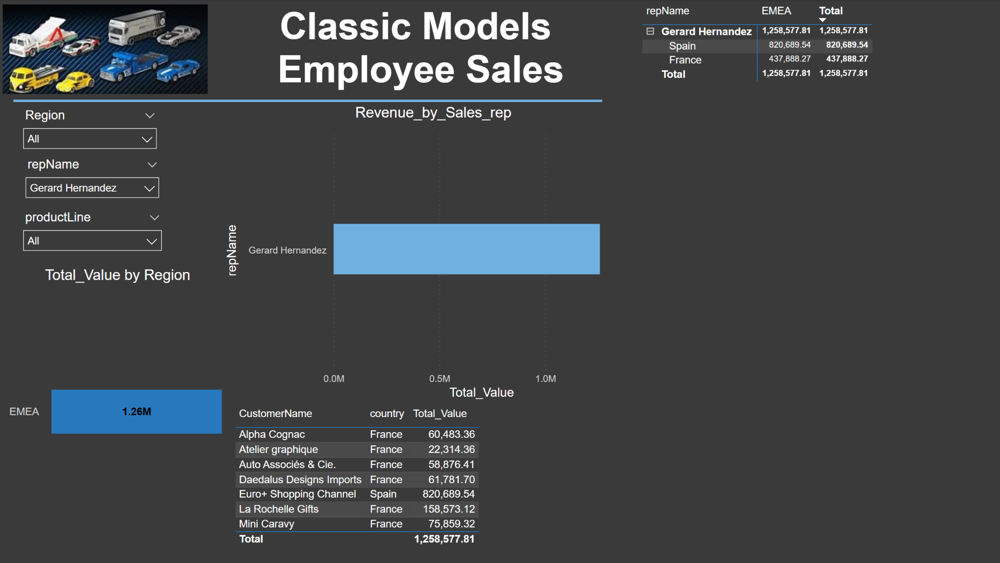
Fig.14.

## Notes
Of all the technologies, Power BI is the one I like and enjoy the most. The visuals obtained can drive your teams in the right direction by tracking performance using KPIs. I am sharing the link to get the .pbix file in case anyone wants to replicate these dashboards. Please note: Once you click on the link, the directory may seem empty, but you have to hit the 'Download' button to get the .pbix file. Here is your link: [Power_BI_Scenarios.pbix](assets/scripts/Power_BI_Scenarios.pbix).

## License
Copyright (c) 2024 josericodata. This project is made available under the MIT License - see the [LICENSE](LICENSE) file for more details.